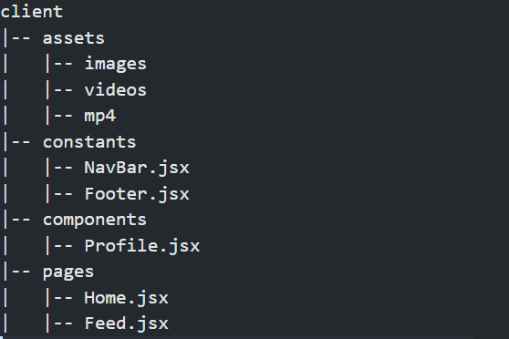

folder workflow:

cd client:

client


### Installation

1. Clone this repository to your local machine.

```bash
git clone https://github.com/ItsRoy69/Google-Solution
```

2. Navigate to the project directory.

```bash
cd Google-Solution
cd client
```

3. Install dependencies.

```bash
npm install
```

### Running the App

Start the frontend application.

```bash
npm run dev
```

Few Instructions:

- Naming format of folders should be in "smallcase"

- Used tailwind for consistent styling, if any component has styling which are not needed in other files/pages then use the "name.css" to include the css property tehre, other styles which are same in all componenets should be included and modified inside "index.css"

- Naming format of jsx files should be in "PascalCase"

## CHATBOT
- To run the chatbot, first create a virtual environment (if you don't already have one).
  - ### Creating Virtual Environment
    - Use this command in powershell: ` python -m venv venv` and if it does not work, you may use this command: `python -m virtualenv venv`.
- Then, activate the virtual environment.
  - ### Activating the virtual environment
    - Use `venv/Scripts/Activate.ps1` to activate the virtual environment.
- After that, you will have to install the packages that are required to run the python files. The packages are listed in the `requirements.txt` file.
    - ### Installing the packages
      - Use `pip install -r requirements.txt` to install the packages.
- To run the `chat.py` file, use the command: `python chat.py`
- To run the `chat-flask.py` file, use the command: `python chat-flask.py`
- You will need a GCP (Google Cloud Platform) account to run both the `chat.py` and `chat-flask.py` files.
  - After creating the GCP account, enable the **Vertex AI API**.
  - Then, to use the API, you will need to authenticate the request. You may do that by setting **ADC(Application Default Credentials)**.
    - Docs to refer to set ADC: [ADC using Google Cloud CLI](https://cloud.google.com/docs/authentication/gcloud#gcloud-credentials) , [ADC using Service Account Key](https://cloud.google.com/kubernetes-engine/docs/tutorials/authenticating-to-cloud-platform)
  - If you are using *service account key* for authentication:
    - Add the role: **Vertex AI User** to your service account by going to the **IAM** tab on your GCP Console.
    - Add your service account key as an environment. You may use the variable *GOOGLE_APPLICATION_CREDENTIALS* to name your environment.
    - **Remember to only provide the path to your service account key file in the environment, and not the content, since only the location of the key is expected.
- Once you run the `chat-flask.py` file, you may test if the REST API is working properly either by using `curl` or by using any other API testing platform. Since the API only accepts `POST` requests, clicking on the localhost link will result in a *405 Method Error*.

### Deployed link for the Chatbot: 

[Chatbot link](https://googlesolchatbot.onrender.com/chat)

